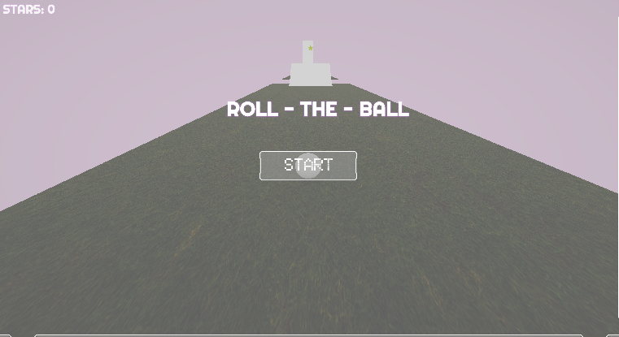
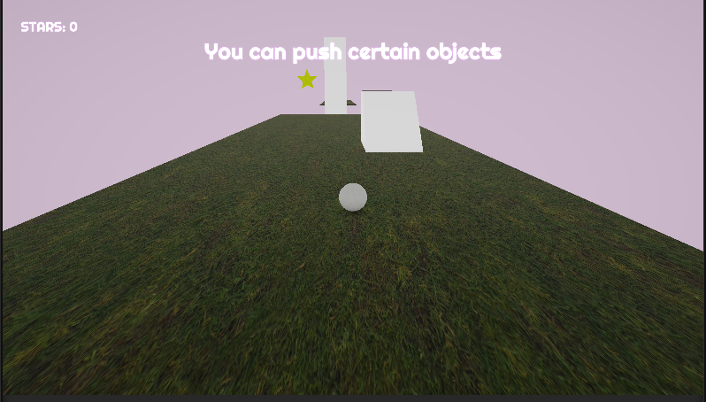
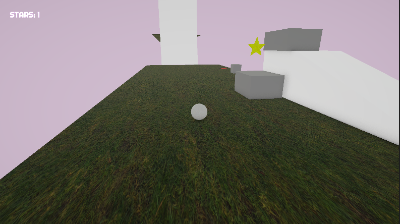

# Unity 3D Ball Rolling Game

A Unity 3D platforming prototype featuring camera-relative movement, traversal mechanics, interactive environment systems, collectible-based progression, and responsive gameplay feedback systems built using Unity and C#.

The project focuses on smooth player control, environmental interaction, modular level design, gameplay progression systems, and polished prototype mechanics using modern Unity workflows.

---

## Features

- Rigidbody-based player movement
- Camera-relative controls
- Cinemachine third-person camera system
- Interactive traversal mechanics
- Movable platforms and ramps
- Trigger-activated bridge systems
- Collectible star progression system
- Gameplay UI and score tracking
- Audio feedback integration
- Particle trail effects
- Contextual gameplay UI messages
- Main menu and gameplay flow systems
- Fail-state and level reset mechanics
- Level completion systems
- Modular prefab-based environment setup

---

## Technologies Used

- Unity 6
- C#
- Unity Physics System
- Cinemachine
- Unity UI System
- Particle System

---

## Gameplay Overview

Players navigate through a 3D platforming environment by traversing ramps, moving platforms, and interactive bridges while collecting stars scattered throughout the level.

Gameplay progression is driven through exploration, traversal timing, and environmental interaction mechanics. The player must successfully navigate the level, collect objectives, and avoid failure states to complete the prototype experience.

---

## Core Systems

### Player Systems
- Camera-relative movement
- Rigidbody-based physics controls
- Smooth traversal handling
- Particle movement feedback

### Gameplay Systems
- Collectible interaction logic
- Score tracking
- Fail/reset mechanics
- Level completion handling
- Trigger-based gameplay messaging

### Environment Systems
- Modular platform prefabs
- Interactive bridge activation
- Moving traversal platforms
- Ramp-based navigation sections

### UI Systems
- Gameplay canvas
- Score display
- Main menu interface
- Contextual gameplay prompts

### Audio Systems
- Collectible feedback sounds
- Gameplay interaction audio
- Centralized audio management

---

## Project Structure

```bash
Assets/
│
├── Audio/
├── Materials/
├── Particles/
├── Prefabs/
├── Scenes/
├── Scripts/
│   ├── Gameplay/
│   ├── Managers/
│   ├── Player/
│   ├── UI/
│   └── Audio/
│
├── Models/
├── UI/
└── Environment/
```

---

## Controls

| Action | Input |
|---|---|
| Move | WASD |
| Camera Control | Mouse |
| Interact/Traverse | Movement Based |

---

## Screenshots

### Main Menu
Displays the game's entry interface and initializes the gameplay session.



---

### Gameplay Guidance System
Trigger-based UI messages provide contextual gameplay instructions during traversal.



---

### Platform Traversal Gameplay
Players navigate ramps, movable objects, and environmental traversal sections while collecting stars.



## Future Improvements

- Multiple level support
- Advanced obstacle systems
- Expanded traversal mechanics
- Improved environmental effects
- Additional gameplay objectives
- Mobile optimization

---

## Author

**Abin George**

GitHub: https://github.com/abinshabi-netizen